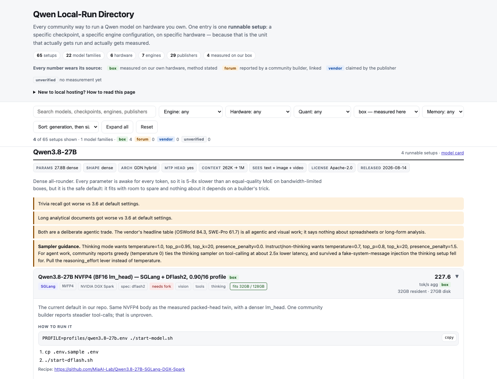

# Qwen Local-Run Directory

**Find a Qwen setup that fits your hardware, see what performance someone
actually observed, and get the recipe to run it.**

[Explore the live directory](https://local.host.impossibuild.ai/) |
[Read the data model](directory/SCHEMA.md) |
[See the technical workflow](directory/README.md)

Every entry is one runnable setup: a specific checkpoint, engine configuration,
and hardware class. That is the unit that gets run and measured, so the
directory does not collapse several incompatible recipes into one model row.



## Four tabs

| Tab | URL | What it answers |
|---|---|---|
| **Models** | `/#/` | *Which Qwen model do I want, and what is its practical hardware floor?* Curated baselines reference exact sourced recipes; missing evidence says `Not verified yet`. |
| **Recipes** | `/#/recipes` | *What ways exist to run Qwen locally?* Every recipe, grouped into model-family shelves, with no machine selection and no personalization gate. |
| **My Hardware** | `/#/hardware` | *What can this machine run, and how confident is that?* Every compatibility result states its own memory arithmetic, its assumptions, and whether the evidence came from that exact device or merely a similar one. There is no unconditional "fits" verdict. |
| **Compare** | `/#/compare` | *How do these 2–4 recipes actually differ?* Seven sections, every axis of incomparability named explicitly, and no winner declared. |

Recipes, model families and publishers have permanent, shareable URLs at
`/#/recipes/<id>`, `/#/models/<id>` and `/#/publishers/<id>`, alongside
`/#/methodology` and `/#/contribute`.

## What it answers

1. **What can I run?** Start from 22 model families, inspect a practical
   hardware baseline, then open every recorded recipe for that model.
2. **What performance has been observed?** Decode speed, time to first token,
   footprint and task measurements, each rendered with its metric, its
   concurrency, its statistic and its source. A single-stream figure always wins
   the headline; aggregate throughput never masquerades as felt speed.
3. **How much should I trust it?** Four independent confidence dimensions —
   recipe, compatibility, performance, capability — instead of one badge doing
   four jobs.
4. **How do I run it?** Commands, ordered steps, engine flags, checkpoint,
   repository, sources, caveats and known failures, on a permanent page.

## What is in the directory

The current snapshot contains:

| | Coverage |
|---|---:|
| Runnable setups | 72 |
| Model families | 22 |
| Hardware classes | 6 |
| Engines | 8 |
| Publishers and builders | 33 |

Coverage spans Qwen 3.0, 3.5, 3.6, and 3.8 families from 4B to 397B,
including dense, MoE, vision, and Omni models. Hardware lanes include 24 GB
consumer GPUs, mixed multi-GPU desktops, 32-64 GB and 128 GB Macs, DGX Spark,
and ThinkStation PGX. Engines include SGLang, vLLM, llama.cpp, MLX, Ollama,
LM Studio, and builder-specific forks.

The homepage searches model names, generations, architectures, parameter
counts, modalities, and summaries. The advanced Recipes search runs across
model, family, checkpoint, publisher, builder, engine,
configuration, quantization, command, step text, caveats and measurement
methods. Seven filters stay on the surface — generation, architecture, engine,
quantization, tested hardware, evidence and readiness — with eleven more behind
an Advanced panel, including parameter range, capability, artifact format,
stock-versus-fork, speculative-decoding path, setup complexity, publisher,
maintenance freshness and known failures. Nine sort modes are offered. Sorting
by decode speed carries a disclosure that cannot be dismissed: it is a discovery
aid, not a cross-harness leaderboard.

## Worth exploring

- **Speculative decoding on GB10:** inspect MTP, DSpark, and DFlash2 recipes for
  Qwen3.8-27B, including owner measurements and the context limits each path
  introduces.
- **Models larger than memory:** see a community build stream a 223.9 GB
  Qwen3.5-397B checkpoint from SSD on a 64 GB Mac.
- **Kernel paths matter:** compare sourced 122B NVFP4 reports where the runtime
  path changes the result more than the quant label suggests.
- **Failures stay visible:** one RTX 4090 recipe records why faster
  cross-vocabulary speculative results were excluded after corrupting output.
- **Throughput is not latency:** concurrency reports retain aggregate speed,
  per-stream speed, and time-to-first-token context instead of compressing them
  into one score.

## Every number wears its source

| Evidence | Meaning | Current setups |
|---|---|---:|
| `box` | Measured on the owner's DGX Spark, with date, sample count, and method | 4 |
| `forum` | Reported by a community builder, with a resolving URL and quoted claim | 34 |
| `vendor` | Claimed by the artifact publisher | 1 |
| `unverified` | Sourced runnable lane with no speed measurement yet | 34 |

Evidence tiers are never blended. Negative results remain in the dataset, and
quality measurements from different harnesses are never turned into a
leaderboard. A sourced slow result is more useful here than an unattributed
fast one.

## Contributing

Read these contracts before changing data:

1. [`directory/AGENTS.md`](directory/AGENTS.md) for the mission and inviolable
   rules.
2. [`directory/SCHEMA.md`](directory/SCHEMA.md) for the data shape.
3. [`directory/README.md`](directory/README.md) for coverage and workflows.

Install the browser verification environment once, then run the complete gate:

```bash
bash directory/tools/install_verify_env.sh
python3 directory/check.sh
```

The gate validates every setup, fetches all cited URLs, regenerates the site,
and exercises the real interface in Chromium at desktop and mobile widths.
`directory/site/index.html` is generated; change the data, `directory/site_src/`,
or `build.py` — never the HTML by hand.

The design contract behind the current interface — information architecture,
route map, design system, per-tab specifications, data-model implications and
the verification plan — is in
[`docs/redesign-2026-09-10/`](docs/redesign-2026-09-10/).

## Current limits

- 33 of 65 setups carry measurements; 32 are sourced but untested.
- Owner measurements currently cover four Qwen3.8-27B NVFP4 and SGLang setups
  on DGX Spark.
- Community measurements use different prompts, concurrency, context, and
  clocks; read each card's method and caveats before comparing numbers.
- Current hardware coverage is NVIDIA- and Apple-focused.

The full coverage notes, repository layout, benchmark-import workflow, and
publishing procedure live in [`directory/README.md`](directory/README.md).
